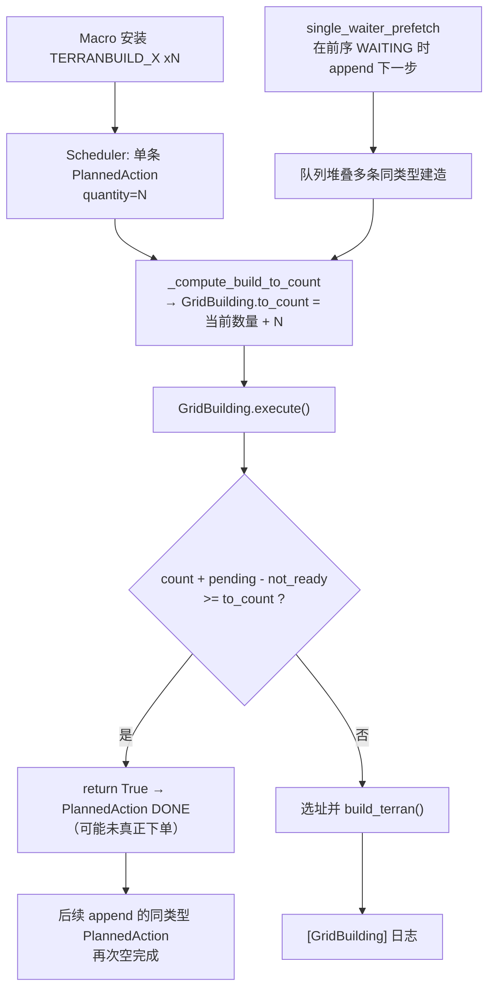

# 同类建筑「重复下单 / 提前完成」Agent Bug 分析

> **类型**：UniversalLLMBot 宏观执行层 Bug（与具体策略文案无关）  
> **复现记录**：`game_records/marine_rush_full/20260617_132254_mr_hard_air/`  
> **关联代码**：`SC2_Agent/execution/scheduler.py`、`sharpy/plans/acts/grid_building.py`、`dummies/generic/universal_llm_bot.py`  
> 本文做**问题定位、机制说明与修复方案**。

---

## 1. 现象（Agent 视角）

宏观流水线（Naming → 映射 → Ordering → Supply → Scheduler）**正确识别**了多条「建造同类型 Terran 生产建筑」的指令（例如 `TERRANBUILD_BARRACKS`），并成功装入调度器。但游戏内实际落地的建筑数量 **少于** LLM 规划的数量。

典型表现：

| 层级 | 预期 | 实际 |
|------|------|------|
| LLM / 调度器安装 | 多条 `TERRANBUILD_* xN` 入队，累计识别 N 次建造 | 日志可见 `Installed ... TERRANBUILD_BARRACKS x3` 等 |
| 游戏内 GridBuilding | 每次真正选址下单应出现一行 `[GridBuilding] BARRACKS at (...)` | **仅出现 2 行**，之后不再建造 |
| 终局统计 | 与规划一致 | `[GameAnalyzerEnd] BARRACKS total: 2 alive: 2` |

**关键点**：Naming / Stage3 映射没有丢动作；问题出在 **Scheduler + GridBuilding 的执行语义**，导致后续 PlannedAction 被 **空完成（mark DONE 但未下单）**。

---

## 2. 日志证据

### 2.1 流水线侧：指令已识别并入队

```text
Stage2 named items: [{'name': 'Barracks', 'count': 3}, ...]
Stage3 mapped actions: {'TERRANBUILD_BARRACKS': 3, ...}
Installed 3 planned actions into scheduler (mode=replace):
  ['TERRANBUILD_SUPPLYDEPOT x1', 'COMMANDCENTERTRAIN_SCV x6', 'TERRANBUILD_BARRACKS x3']
```

后续 macro cycle 又以 `mode=append` 追加：

```text
Installed 5 planned actions into scheduler (mode=append):
  [..., 'TERRANBUILD_BARRACKS x2', ...]
Installed 5 planned actions into scheduler (mode=append):
  [..., 'TERRANBUILD_BARRACKS x1', ...]
```

累计 **6 次** `TERRANBUILD_BARRACKS` 规划（3+2+1），均来自不同 macro cycle 的 append。

### 2.2 执行侧：仅 2 次真实建造

```text
01:05  [GridBuilding] BARRACKS at (32.5, 135.5)
01:22  [GridBuilding] BARRACKS at (39.5, 142.5)
（此后无第三条 GridBuilding BARRACKS）
```

终局：

```text
[GameAnalyzerEnd] BARRACKS  total: 2  alive: 2  dead: 0
```

### 2.3 Prefetch 触发时，前序建造尚未开始

JSON 轨迹 `20260617_132254_mr_hard_air.json` 中，第一次 `single_waiter_prefetch` 记录：

```json
"trigger_reason": "single_waiter_prefetch",
"mode": "append",
"pending_actions_before_step": "  - TERRANBUILD_BARRACKS x3 (0/3 issued) [WAITING]"
```

含义：第一次 prefetch 触发时，队列里 **唯一的非终态动作** 是 `BARRACKS x3`，状态为 `WAITING`，且 **0/3 issued（一砖未动）**。此时 macro 已推进到下一 strategy step 并 **append** 新的 `TERRANBUILD_BARRACKS x2` 等动作。

### 2.4 未出现的异常信号

本局日志中 **没有**：

- `Abandoned ...`（WAITING / RUNNING 超时放弃）
- `Can't find free position to build BARRACKS in!`（落点失败）
- `abandoned: build stuck`

说明问题不是资源耗尽、落点彻底失败或超时放弃，而是 **正常路径下被误判为已完成**。

---

## 3. 根因链（三层机制叠加）



---

### 3.1 根因 A：GridBuilding 过早返回「Building is ordered」

**文件**：`sharpy/plans/acts/grid_building.py`

```150:159:sharpy/plans/acts/grid_building.py
        if (
            count + (self.pending_build(self.unit_type) - self.cache.own(self.unit_type).not_ready.amount)
            >= self.to_count
        ):
            ...
            return True  # Building is ordered
```

**机制**：

- `count`：已建成 + 未完工的结构数量（`include_not_ready=True`）。
- `pending_build`：`get_count(含 pending) - get_count(不含 pending)`，对人族还会统计 **SCV 携带建造指令但尚未放置** 的工单（见 `act_base.py:pending_building_positions`）。
- 当第二座仍在建造、或 pending 计数与人族 SCV 工单叠加时，**算术和可能 ≥ `to_count`，act 直接 `return True`**，不再调用 `build_terran()` 下新单。

**后果**：Scheduler 收到 `done=True`，将整个 PlannedAction 标为 `DONE`：

```381:384:SC2_Agent/execution/scheduler.py
        if done:
            pa.state = DONE
            pa.issued_count = pa.quantity
            pa.note = "done"
```

一条 `TERRANBUILD_BARRACKS x3` 可能在 **只 physically 建造 2 座** 后就被整体标记完成。

**为何日志只有 2 次 GridBuilding**：第 3 次建造请求在 GridBuilding 内部被上述分支短路，**不会打印** `[GridBuilding] BARRACKS at (...)`。

---

### 3.2 根因 B：Scheduler 用「绝对 to_count」+ 多条 PlannedAction 叠加

**文件**：`SC2_Agent/execution/scheduler.py`

安装时，同类建造被 **折叠** 为 `(action_name, quantity)` 单条 PlannedAction（见 `universal_llm_bot.py` 的 `_collapse_runs`）。每条 PlannedAction 创建 GridBuilding 时：

```415:427:SC2_Agent/execution/scheduler.py
    def _compute_build_to_count(self, pa: PlannedAction) -> int:
        ...
        current = self._equivalent_existing_count(unit_type) if unit_type else 0
        return int(current) + int(pa.quantity)
```

语义是 **「建完后场上应有 current + quantity 座」**，不是「再建 quantity 座（增量）」。

当 macro **append** 多条同类型 PlannedAction 进同一队列时（见 3.3），会出现：

| 队列中的 PlannedAction | 创建 act 时 current | to_count | 实际行为 |
|------------------------|---------------------|----------|----------|
| 第 1 条 `x3` | 0 | 3 | 建 2 座后可能被 3.1 提前 DONE |
| 第 2 条 `x2` | 2 | 4 | 轮到执行时已有 2 座，pending 公式再次 ≥ target → **空完成** |
| 第 3 条 `x1` | 2 | 3 | 同上，第 3 座永远不会下单 |

Scheduler 还有一道 **防重复放置** 闸（`_existing_plus_en_route >= _act_target_count`），会在 act 执行前直接 DONE：

```361:373:SC2_Agent/execution/scheduler.py
        if pa.category == mapping.CAT_BUILD and pa._act_target_count is not None:
            ...
            if unit_type is not None and self._existing_plus_en_route(unit_type) >= pa._act_target_count:
                pa.state = DONE
                pa.issued_count = pa.quantity
                pa.note = "done (build already in flight)"
```

当 `to_count` 设得偏低（例如已有 2 座、target=3 且 en_route 计数偏高）时，也会 **未下单即 DONE**。

**设计缺口**：队列层面 **没有对同类型 `TERRANBUILD_*` 做 dedup / 合并**；append 模式下旧 PlannedAction 未 DONE 就追加新 PlannedAction，目标数量互相重叠。

---

### 3.3 根因 C：`single_waiter_prefetch` 在前序建造 WAITING 时 append 下一步

**文件**：`dummies/generic/universal_llm_bot.py`

```444:455:dummies/generic/universal_llm_bot.py
        elif since >= self.MACRO_MIN_RETRIGGER and single_waiter:
            ...
                trigger_reason = "single_waiter_prefetch"
                install_mode = "append"
                self._prefetched_while_waiter_key = waiter_key
```

**触发条件**（`SC2_Agent/execution/scheduler.py`）：

```110:113:SC2_Agent/execution/scheduler.py
    def is_single_waiter_remaining(self) -> bool:
        active = [a for a in self.actions if not a.is_terminal()]
        return len(active) == 1 and active[0].is_waiting()
```

当队列里 **只剩 1 个 WAITING**（例如 `TERRANBUILD_BARRACKS x3` 在等矿物/前置），且距上次 macro ≥ `MACRO_MIN_RETRIGGER`（5s），Bot 会：

1. 用 **下一步** strategy step 文本再跑一遍 LLM 流水线；
2. 以 **`append`** 把新动作接到队列末尾（不丢弃 WAITING 者）；
3. **`_advance_strategy_step_after_install`** 仍执行，strategy step 索引 +1。

**与本 Bug 的关系**：prefetch 本身不是错误设计（目的是减少 macro 空转），但它会在 **前序同类型建造尚未 issued** 时就把 **新的同类型建造 PlannedAction** 堆进队列，放大 3.1 + 3.2 的叠加效应。

本局日志：`TERRANBUILD_BARRACKS x3 (0/3 issued) [WAITING]` 时即触发 prefetch 并 append `BARRACKS x2`。

---

## 4. 因果时序（本局记录摘要）

| 游戏时间 | 事件 | 队列 / 场上状态 |
|----------|------|-----------------|
| 00:00 | `initial_step`，replace 安装 `BARRACKS x3` 等 | 0 座 |
| ~00:56 | `single_waiter_prefetch`，append 下一步（含 `BARRACKS x2`） | `BARRACKS x3` 仍 WAITING，0/3 issued |
| 01:05 | 第 1 次 GridBuilding | 开始建第 1 座 |
| 01:22 | 第 2 次 GridBuilding | 开始建第 2 座 |
| ~02:03 | 又一次 prefetch，append `BARRACKS x1` | 1 座完成 + 1 座在建 |
| ~02:28 | 观测 | **2 座 BARRACKS 完工**，无第 3 座 |
| 终局 | GameAnalyzerEnd | BARRACKS total: **2** |

---

## 5. 排除项

| 假设 | 结论 |
|------|------|
| Naming / Stage3 未识别建造动作 | ❌ 日志有完整 `named_items` / `mapped_actions` |
| 矿物不足 | ❌ 01:05 / 01:22 时有 300M；后期矿堆积 |
| Supply 前置不满足 | ❌ 前两座已成功建造 |
| 落点彻底失败 | ❌ 无 `Can't find free position` |
| WAITING / RUNNING 超时 ABANDON | ❌ 无 `Abandoned` 日志 |
| 策略文件写错 | ⚠️ 策略文本可能影响 LLM 输出条数，但 **即使 LLM 输出正确，执行层仍会少建**；属 Agent bug，非策略专属 |

---

## 6. 影响范围

凡满足以下条件的宏观建造，均可能受影响：

- 动作类型为 **`CAT_BUILD`**，经 `GridBuilding` 落地（Barracks / Factory / Starport / SupplyDepot 等）；
- 同一 macro 周期或跨周期 **多条 PlannedAction 指向同一 `UnitTypeId`**；
- 存在 **`single_waiter_prefetch` append**，在前序建造 WAITING 时叠加新建造指令；
- `quantity > 1` 的单条 PlannedAction（一条 act 负责多座，依赖 GridBuilding 循环建造）。

**Train / Morph / Addon** 走不同路径（`_issue_train_addon_morph`），不受 GridBuilding 150–159 行影响；本 Bug 主要针对 **连续放置同类建筑**。

---

（见 §11 扩展修复方案，整合了原建议与补充排查的新发现。）

**原建议（已被整合到下方 §11）**：
1. GridBuilding early-return 收紧、2. Scheduler 合并/dedup、3. Prefetch 守卫、4. WARN 观测日志。

---

## 8. 相关文档与代码索引

| 主题 | 位置 |
|------|------|
| Prefetch 触发与 append 语义 | `docs/系统文档.md` §3 触发机制、§4.2 单等待者预取 |
| PlannedAction 状态机 | `docs/系统文档.md` §4.1 |
| Macro 流水线入口 | `dummies/generic/universal_llm_bot.py` → `pre_step_execute`、`_run_macro_pipeline_blocking` |
| 队列安装 append/replace | `SC2_Agent/execution/scheduler.py` → `set_actions` |
| 建造 act 创建与 DONE 判定 | `SC2_Agent/execution/scheduler.py` → `_issue_build_or_research`、`_compute_build_to_count` |
| 选址与 early complete | `sharpy/plans/acts/grid_building.py` → `execute` |
| pending 统计 | `sharpy/plans/acts/act_base.py` → `pending_build`、`pending_building_positions` |

---

## 9. 回归检查命令

对任意受影响的对局记录目录 `<match_dir>`：

```powershell
# 规划侧：共识别几次同类建造
Select-String -Path <match_dir>\*.log -Pattern 'TERRANBUILD_BARRACKS|TERRANBUILD_FACTORY|Installed.*BUILD'

# 执行侧：实际 GridBuilding 下单次数
Select-String -Path <match_dir>\*.log -Pattern '\[GridBuilding\]'

# Prefetch 叠加
Select-String -Path <match_dir>\*.json -Pattern 'single_waiter_prefetch|pending_actions_before_step'

# 终局数量
Select-String -Path game_records\*_stderr.log -Pattern 'GameAnalyzerEnd.*BARRACKS|GameAnalyzerEnd.*FACTORY'
```

预期（修复前）：Installed 次数 > GridBuilding 行数，终局 total < LLM 累计 quantity。

---

## 10. 补充排查：代码审查额外发现

以下问题通过对 `scheduler.py`、`act_base.py`、`grid_building.py`、`universal_llm_bot.py` 的逐行审查发现，独立于文档前三项根因，但与之相互作用。

---

### 10.1 `get_count` 计数 Bug：`include_not_ready=True` 时漏计 not_ready（底层根源）

**文件**：`sharpy/plans/acts/act_base.py`

`get_count` 有四个条件分支，当 `include_not_ready=True, include_pending=True` 时：

```python
# case: include_not_ready=True, include_pending=True
count += self.unit_pending_count(unit_type)   # already_pending (SC2 API)
count += type_count.ready.amount              # ⚠️ 漏掉了 type_count.not_ready.amount
```

对比 `include_not_ready=True, include_pending=False` 分支：

```python
# case: include_not_ready=True, include_pending=False
count += type_count.amount   # = ready + not_ready  ← 正确包含了 not_ready
```

两个分支在 `not_ready > 0` 时结果不一致。这导致 `pending_build` 的返回值出错：

```python
def pending_build(self, unit_type):
    return self.get_count(unit_type) - self.get_count(unit_type, include_pending=False)
# get_count(unit_type)                         = already_pending + ready
# get_count(unit_type, include_pending=False)  = not_ready + ready
# pending_build                                = already_pending - not_ready   ← 应该是 already_pending
```

`pending_build` 返回了 `already_pending - not_ready` 而非 `already_pending`。这个值向上传染到 GridBuilding 的 early-return 公式（count + pending_build - not_ready），实际展开为：

```
(ready + not_ready + flying) + (already_pending - not_ready) - not_ready
= ready + flying + already_pending - not_ready
```

not_ready 被**减了一次**（本该是加），使得该条件几乎永不为真——换言之 GridBuilding 的 early-return 分支在当前实现下实际是"死代码"，并非造成少建的直接触发点。真正导致 premature DONE 的更可能是 Scheduler 的**防重复放置闸**（见 §3.2 所述 `_existing_plus_en_route >= _act_target_count` 分支，以及 §10.5 的帧级竞态）。

**修复**（`act_base.py` 第 151-153 行）：

```diff
 if include_not_ready and include_pending:
     count += self.unit_pending_count(unit_type)
-    count += type_count.ready.amount
+    count += type_count.amount
```

这样 `pending_build` 将返回正确的 `already_pending`，GridBuilding 的公式也随之修正为 `ready + not_ready + flying + already_pending`。

**严重度**：高。这是整个建造计数链条的底层缺陷，影响所有依赖 `get_count` / `pending_build` 的判断逻辑。

---

### 10.2 `_collapse_runs` 只合并「连续相同」的动作

**文件**：`dummies/generic/universal_llm_bot.py`

```python
@staticmethod
def _collapse_runs(flat: List[str]) -> List[Tuple[str, int]]:
    pairs: List[Tuple[str, int]] = []
    for name in flat:
        if pairs and pairs[-1][0] == name:   # ← 仅比较紧邻的前一个
            prev, cnt = pairs[-1]
            pairs[-1] = (prev, cnt + 1)
        else:
            pairs.append((name, 1))
    return pairs
```

如果 Ordering Agent 的 LLM 输出交错排序（如 `[BARRACKS, MARINE, BARRACKS]`），即使 `_reconcile_multiset` 通过了对账，`_collapse_runs` 仍会产生两个独立的 `(BARRACKS, 1)` 条目。它们各自在 Scheduler 中创建独立的 `PlannedAction`，每个都有绝对 `to_count`，互不知晓对方的存在。

这意味**即使没有跨周期的 prefetch，同一个 macro 周期内也可能产生多条独立的同类型建造 PlannedAction**，直接加剧了根因 B（§3.2）。

**修复**：在 collapse 之前按 action name 做一次全局合并（如用 `Counter` 聚合）：

```python
from collections import Counter
merged = Counter(flat)
pairs = list(merged.items())  # 需要保留 LLM 的顺序偏好时可额外处理
```

**严重度**：中。与根因 B 叠加时放大影响。

---

### 10.3 `set_actions("replace")` 丢弃旧 action 时不清理 worker 预留

**文件**：`SC2_Agent/execution/scheduler.py`

```python
def set_actions(self, pairs, mode="replace"):
    new_actions = [...]
    if mode == "append":
        kept = [a for a in self.actions if not a.is_terminal()]
        self.actions = kept + new_actions
    else:
        self.actions = new_actions   # ← 旧 PlannedAction 列表被直接丢弃
```

旧 `_act` 对象（GridBuilding 等）的 `builder_tag` 引用成为孤儿——被占用的 SCV 永久停留在 `UnitTask.Building` 角色，无法被回收用于后续建造。

虽然 `replace` 理论上只在队列已排空（`scheduler_drained`）时调用，但 `_abandon_stuck_running`（§10.4）会把卡死的 RUNNING 动作标为 ABANDONED（此时 `builder_tag` 可能非空），而后续 `replace` 会丢弃它，造成泄漏。

**修复**：在 `set_actions` 的 replace 分支中，对每个被丢弃的 action 调用清理：

```python
else:
    for old in self.actions:
        if getattr(old._act, "clear_worker", None):
            try:
                old._act.clear_worker()
            except Exception:
                pass
    self.actions = new_actions
```

**严重度**：低。在正常对局中触发条件苛刻，但长期游戏可能累积导致可用 SCV 减少。

---

### 10.4 `_abandon_stuck_running` 不释放 worker

**文件**：`SC2_Agent/execution/scheduler.py`

```python
def _abandon_stuck_running(self, now: float) -> None:
    ...
    if (now - pa.running_start_time) > self.running_abandon_sec:
        pa.state = ABANDONED
        pa.note = "abandoned: build stuck (no placement / cannot order)"
        pa.running_start_time = None
        # ⚠️ 没有调用 clear_worker()
```

对比 Scheduler 的防重复闸（第 368 行）在 DONE 时会调用 `pa._act.clear_worker()`，而 ABANDON 路径没有对称处理。

**修复**：在 ABANDON 之前调用 `clear_worker()`：

```diff
 pa.state = ABANDONED
 pa.note = "abandoned: build stuck (no placement / cannot order)"
 pa.running_start_time = None
+if getattr(pa._act, "clear_worker", None):
+    try:
+        pa._act.clear_worker()
+    except Exception:
+        pass
```

**严重度**：低。与 §10.3 共同构成 worker 泄漏的完整链条。

---

### 10.5 防重复放置闸的帧级数据源竞态

**文件**：`SC2_Agent/execution/scheduler.py`

防重复闸 `_existing_plus_en_route >= _act_target_count`（第 361-363 行）在 `GridBuilding.execute()` **之前**触发。`_existing_plus_en_route` 混合了两个数据源：

- `existing`：来自 sharpy cache（`self.get_count(include_pending=False)`）；
- `en_route`：来自 SC2 API 的 `self.ai.workers` 订单扫描。

这两个数据源在同一帧内**可能不同步**：当 SCV 刚放下建筑，sharpy cache 已更新（`not_ready + 1`），但 SC2 API 中该 SCV 的 build order 可能尚未被清除。此时 `existing + en_route` 会比实际多 1，在 `existing=2, en_route=1`（实际应 =0）时即可满足 `>= 3` 的条件，导致闸门误触发 DONE。

竞态窗口极短（单帧），但在多 barracks 连续下单的高频率场景（如 §4 时序中 01:05 和 01:22 密集建造）下可能命中：第 2 座建造指令下达后，若 SCV 在同一帧内放置了第 1 座，数据源的不一致可能使 `_existing_plus_en_route` 达到 3，将 `BARRACKS x3` 整体标为 DONE，阻止第 3 座下单。

**修复**：优先使用单一数据源；或将 `en_route` 的扫描范围限制为「尚未在任何 sharpy cache 中出现的工单」（交叉校验 worker order target 与已有结构位置）。

**严重度**：中。可能是本局实际 premature DONE 的触发机制。

---

### 10.6 同类型 PlannedAction 之间缺乏协调

**文件**：`SC2_Agent/execution/scheduler.py`（全局设计）

当队列中存在同一个 `UnitTypeId` 的多条 PlannedAction（如 `BARRACKS x3 [RUNNING]` + `BARRACKS x2 [PENDING]`），后一条在创建 GridBuilding 时：

1. `_compute_build_to_count` 只读取**场上已有的结构数**，看不到前一条已下达但尚未放置的 SCV 工单；
2. `_act_target_count` 基于当前快照设定后固定不变；
3. 前一条 DONE 之后后一条才开始，但此时场上结构和前一条遗留的「在途工单」的关系已经变化，后一条的 `to_count` 可能偏低。

结果：后一条 GridBuilding 可能发出**与前一条重叠的建造工单**，或目标数计算失准。本质是队列层面对同类型建造**缺乏全局计数和工单追踪**。

**修复**：在 `_compute_build_to_count` 和 `_existing_plus_en_route` 中纳入**队列中其他同类型 PlannedAction 的已下达工单**（可通过汇总 `issued_count` 或扫描所有 `_act` 状态实现）。

**严重度**：中。与根因 B（§3.2）共同构成多 PlannedAction 叠加时的计数混乱。

---

## 11. 扩展修复方案

按优先级排列，整合原始建议（§7）与补充排查（§10）：

1. **[P0] `get_count` 修复**（§10.1）：`act_base.py` 第 153 行改为 `count += type_count.amount`，修复整条计数链路的底层缺陷。

2. **[P0] `_collapse_runs` 全局合并**（§10.2）：在 collapse 之前加一层 `Counter` 聚合，杜绝同周期内非连续同类项分裂为多条 PlannedAction。

3. **[P1] Scheduler 队列层 dedup/合并**（§3.2 + §10.6）：`set_actions(append)` 时对同类型 `TERRANBUILD_*` 做合并，或将 `_compute_build_to_count` 改为维护全局建造目标、纳入队列中其他同类型 PlannedAction 的在途工单。

4. **[P1] 防重复闸去竞态**（§10.5）：`_existing_plus_en_route` 改用单一数据源，或交叉校验避免帧级 double-count。

5. **[P2] Prefetch 守卫**（§3.3）：若队列中已有未 DONE 的同类 `TERRANBUILD_*`，prefetch 产生的建造类动作改为增量补差（`max(0, desired - existing - pending)`）。

6. **[P2] GridBuilding early-return 修正**（§3.1）：在 §10.1 修复后，`pending_build` 返回正确的 `already_pending`，early-return 公式将变为 `ready + not_ready + flying + already_pending >= to_count`；但仍需审查减 `not_ready` 的合理性——当前多余的那次 `- not_ready`（第 154 行显式减法）在 §10.1 修复后仍有冗余，应一并移除。

7. **[P3] Worker 泄漏修复**（§10.3 + §10.4）：
   - `_abandon_stuck_running` 中调用 `clear_worker()`；
   - `set_actions(replace)` 中对丢弃的旧 action 调用 `clear_worker()`。

8. **[P3] WARN 观测日志**（§7.4）：在 PlannedAction DONE 时若 `GridBuilding` 实际下单次数 < quantity，打 WARN 日志（`done without grid placement`），便于回归。

---

## 12. 问题全景总览

| # | 问题 | 位置 | 严重度 |
|---|------|------|--------|
| 文档 3.1 | GridBuilding early-return 公式不可靠 | `grid_building.py:150` | 高 |
| 文档 3.2 | Scheduler 绝对 to_count + 不合并同类项 | `scheduler.py:415,94` | 高 |
| 文档 3.3 | Prefetch 在 WAITING 期间堆叠新指令 | `universal_llm_bot.py:444` | 中 |
| **10.1** | `get_count` 漏计 not_ready（底层根源） | `act_base.py:151` | **高** |
| **10.2** | `_collapse_runs` 不合并非连续同类项 | `universal_llm_bot.py:889` | 中 |
| **10.5** | 防重复闸帧级数据源竞态 | `scheduler.py:361` | 中 |
| **10.6** | 同类型 PlannedAction 无全局协调 | `scheduler.py` 整体 | 中 |
| **10.3** | `set_actions(replace)` 泄漏 worker 角色 | `scheduler.py:94` | 低 |
| **10.4** | `_abandon_stuck_running` 不释放 worker | `scheduler.py:179` | 低 |

---

## 13. 相关文档与代码索引（更新）

| 主题 | 位置 |
|------|------|
| Prefetch 触发与 append 语义 | `docs/系统文档.md` §3 触发机制、§4.2 单等待者预取 |
| PlannedAction 状态机 | `docs/系统文档.md` §4.1 |
| Macro 流水线入口 | `dummies/generic/universal_llm_bot.py` → `pre_step_execute`、`_run_macro_pipeline_blocking` |
| 队列安装 append/replace（含 worker 泄漏） | `SC2_Agent/execution/scheduler.py` → `set_actions` |
| 建造 act 创建与 DONE 判定（含防重复闸） | `SC2_Agent/execution/scheduler.py` → `_issue_build_or_research`、`_compute_build_to_count` |
| ABANDON 无清理 | `SC2_Agent/execution/scheduler.py` → `_abandon_stuck_running` |
| 防重复闸 `_existing_plus_en_route` | `SC2_Agent/execution/scheduler.py:429-457` |
| `_collapse_runs` 不合并非连续项 | `dummies/generic/universal_llm_bot.py:889-897` |
| 选址与 early complete | `sharpy/plans/acts/grid_building.py` → `execute` |
| pending 统计 | `sharpy/plans/acts/act_base.py` → `pending_build`、`pending_building_positions` |
| **`get_count` 计数 Bug** | `sharpy/plans/acts/act_base.py:144-164` |

---

## 14. 回归检查命令（更新）

对任意受影响的对局记录目录 `<match_dir>`：

```powershell
# 规划侧：共识别几次同类建造
Select-String -Path <match_dir>\*.log -Pattern 'TERRANBUILD_BARRACKS|TERRANBUILD_FACTORY|Installed.*BUILD'

# 执行侧：实际 GridBuilding 下单次数
Select-String -Path <match_dir>\*.log -Pattern '\[GridBuilding\]'

# Prefetch 叠加
Select-String -Path <match_dir>\*.json -Pattern 'single_waiter_prefetch|pending_actions_before_step'

# 终局数量
Select-String -Path game_records\*_stderr.log -Pattern 'GameAnalyzerEnd.*BARRACKS|GameAnalyzerEnd.*FACTORY'

# 新增：检查是否有 worker 泄漏信号（Building 角色长期未释放）
Select-String -Path <match_dir>\*.log -Pattern 'abandoned.*build stuck|Abandoned'

# 新增：检查防重复闸是否误触发（done (build already in flight) 与实际 GridBuilding 数对比）
Select-String -Path <match_dir>\*.log -Pattern 'done \(build already in flight\)'
```

预期（修复前）：Installed 次数 > GridBuilding 行数，终局 total < LLM 累计 quantity；修复后二者应一致。