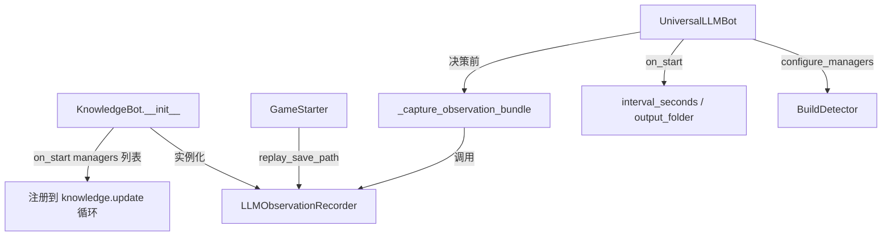
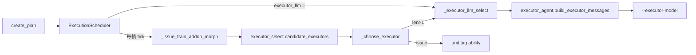

# OBS 系统代码摘录与植入说明

本目录从 [`SC2_Agent_OLD`](C:\code\SC2_Agent_OLD) 摘录两套与「观测 / 执行」相关的子系统，便于独立阅读或移植：

| 子系统 | 职责 | 核心目录 |
|--------|------|----------|
| **观测生成（主系统）** | 把游戏态势整理成「结构化 dict + 英文 obs 文本」，供 Top/Mid/Down/Naming/Ordering 等宏观 Agent 决策 | `sharpy/managers/extensions/` |
| **Executor 执行单位选择** | 在 **train / addon / morph** 真正下发时，从多个候选建筑/单位里选一个 `tag` 执行；**不**使用整段 `[Economy]`/`[Enemy]` obs | `SC2_Agent/executor_agent.py` + `SC2_Agent/execution/` |

> **依赖说明**：代码仍引用原仓库的 `sharpy` 框架（`ManagerBase`、`KnowledgeBot`、`ActBase` 等）。本目录是**可运行的逻辑摘录**，不是开箱即用的独立包；植入时需放回完整 Sharpy + SC2_Agent 工程。

---

## 目录结构

```
obs_system/
├── README.md                          # 本文件
├── sharpy/managers/extensions/
│   ├── llm_observation_recorder.py    # 观测生成核心
│   ├── build_detector.py              # [Threat Flags] 依赖（rush/宏观开局）
│   └── __init__.py
├── SC2_Agent/
│   ├── executor_agent.py              # Executor LLM prompt / 解析
│   ├── execution/
│   │   ├── executor_select.py         # 候选单位规则筛选 + 冲突提示
│   │   ├── scheduler.py               # 调度器：动作下发 + 调 Executor
│   │   ├── mapping.py                 # DB 标准名 → AbilityId / Act
│   │   └── command.py                 # PlannedAction 状态机
│   └── data_tools/
│       ├── data_base_add_graph.json   # 技术图数据库（~2MB，标准命名来源）
│       ├── obs_entities.py            # 实况 → DB 实体名（completed/in_progress）
│       ├── sc2_data_common.py         # load_database / build_executor_index
│       ├── detect_action_conflicts.py # 动作间执行者冲突
│       ├── prereq_runtime.py          # 调度器前置条件推理
│       └── …（check_action_prereqs, entity_to_actions, action_cost）
└── integration/                       # 宿主工程中的接入参考（完整文件副本）
    ├── knowledge_bot.py
    └── game_starter.py
```

---

## 一、观测生成（主系统）

### 1.1 做什么

`LLMObservationRecorder` 每 `interval_seconds`（默认 20s）采样一次，产出：

- **结构化快照** `_build_snapshot()`：`economy` / `own_forces` / `enemy` / `map_control` / `combat` / `memory_flags` / `upgrades`
- **英文 obs 文本** `_generate_english_text_obs(snapshot)`：`[Time]`、`[Economy]`、`[Own Forces & Infrastructure]`、`[Enemy Intelligence]`、`[Map Control]`、`[Combat Analysis]`、`[Threat Flags]`、`[Research & Technology]`

对局结束写入 `<match_id>.json` 的 `record_history[]`；宏观决策时的即时 obs 写入 `interactions[].observation_at_this_moment` / `observation_structured`。

### 1.2 如何植入



**步骤 1 — Sharpy 基类注册 Manager**

文件：`integration/knowledge_bot.py`（原 `sharpy/knowledges/knowledge_bot.py`）

```python
self.llm_observation_recorder = LLMObservationRecorder()
# managers 列表末尾（ActManager 之前）：
managers.append(self.llm_observation_recorder)
```

**步骤 2 — 对局启动时注入落盘路径**

文件：`integration/game_starter.py`

- `setup_bot()`：若 `--record-dir`，设置 `recorder.output_folder`
- `start_game()`：把 `save_replay_as` 同步为 `recorder.replay_save_path`，使 `<match_id>.json` 与 `.SC2Replay` 同前缀

**步骤 3 — UniversalLLMBot 消费观测**

原文件：`dummies/generic/universal_llm_bot.py`（未完整复制，逻辑如下）

```python
def configure_managers(self):
    return [BuildDetector()]  # 增强 [Threat Flags]

async def on_start(self):
    await super().on_start()
    self.llm_observation_recorder.interval_seconds = self.MACRO_POLL_INTERVAL
    if self.record_dir:
        self.llm_observation_recorder.output_folder = self.record_dir

def _capture_observation_bundle(self):
    recorder = self.llm_observation_recorder
    snapshot = recorder._build_snapshot()          # 即时快照，非 record_history 缓存
    text = recorder._generate_english_text_obs(snapshot)
    return text, snapshot
```

宏观流水线（Naming / Ordering）和旧版 Mid/Down 流水线在决策前调用 `_capture_observation_bundle()`，把 `obs_text` 塞进各 Agent 的 `[Current Observation]` 段。

**步骤 4 — 记录 LLM 交互**

`_record_llm_interaction(record)` → `recorder.record_llm_interaction(record)`，最终合并进 `<match_id>.json` 的 `interactions[]`。

### 1.3 依赖的其他 Manager

`llm_observation_recorder.start()` 会解析：

| Manager | 用途 |
|---------|------|
| `IncomeCalculator` | 经济 / 收入 |
| `EnemyUnitsManager` | 敌方情报 |
| `LostUnitsManager` / `GameAnalyzer` | 战损 / 战力 |
| `MemoryManager` | memory_flags |
| `BuildDetector` | `is_rushing` / `rush_build` / `macro_build` → `[Threat Flags]` |

---

## 二、Executor 执行单位选择

### 2.1 做什么

宏观流水线产出的是 **DB 标准 action 名**（如 `BARRACKSTRAIN_MARINE`）。真正执行时：

| 动作类别 | 执行路径 | 是否调 Executor LLM |
|----------|----------|---------------------|
| **build** | `mapping.make_build_act` → Sharpy `GridBuilding` / `Expand` / `BuildGas` | 否 |
| **research** | `mapping.make_research_act` → Sharpy `Tech` | 否 |
| **train / addon / morph** | `get_available_abilities` 筛候选 → **Executor Agent 选 tag** → `unit(ability)` | 仅多候选时 |

Executor **不看**整段 `[Economy]`/`[Enemy]` obs，而是用专用 prompt：

```
[Ability to execute]     BARRACKSTRAIN_MARINE
[Action cost/time]       minerals 50, gas 0, supply 1, ~18s
[Pending actions ...]    未执行动作列表
[Actions currently waiting]  等待资源/科技的动作
[Possible conflicts ...] 候选是否也被后续动作需要
[Candidate Executors]
  - tag=12345 BARRACKS [idle, has TechLab]
  - tag=67890 BARRACKS [idle, no add-on]
```

LLM 输出：`[12345]`（单个 tag）。

### 2.2 如何植入



**步骤 1 — 创建调度器并注入回调**

原文件：`dummies/generic/universal_llm_bot.py` → `create_plan()`

```python
self.scheduler = ExecutionScheduler(wait_abandon_sec=self.WAIT_ABANDON_SEC)
self.scheduler.executor_llm = self._executor_llm_select
return BuildOrder([self.scheduler, background, scout_attack])
```

**步骤 2 — 回调实现**

```python
def _executor_llm_select(self, *, ability_name, candidate_text, cost_hint,
                         pending_summary, waiting_summary, conflict_hints, legal_tags):
    msgs = build_executor_messages(
        ability_name=ability_name,
        candidate_units_text=candidate_text,
        cost_hint=cost_hint,
        pending_actions_summary=pending_summary,
        waiting_actions_summary=waiting_summary,
        executor_conflict_hints=conflict_hints,
    )
    raw = self._call_llm(msgs, agent="executor")  # --executor-model
    return parse_executor_response(raw, legal_tags=legal_tags)
```

**步骤 3 — 调度器内选型逻辑**

文件：`SC2_Agent/execution/scheduler.py` → `_choose_executor()`

1. 仅 1 个候选 → 直接选，**不调 LLM**
2. 多候选 → 调 `executor_llm`；失败则 prefer idle，否则第一个
3. 结果缓存 3s（`EXECUTOR_CACHE_SEC`），避免每帧打 LLM

**步骤 4 — 规则层与冲突提示**

文件：`SC2_Agent/execution/executor_select.py`

- `candidate_executors(ai, ability)`：`get_available_abilities(..., ignore_resource_requirements=True)`
- `executor_conflict_hints(candidates, pending_action_names)`：用 `build_executor_index` + `obs_entities.db_name_for_enum` 判断候选是否也是后续 pending 动作的执行者

### 2.3 与 obs_entities 的关系

| 模块 | 用于 Executor？ | 说明 |
|------|-----------------|------|
| `LLMObservationRecorder` 英文 obs | 否 | 宏观 Agent 专用 |
| `obs_entities.collect_entities()` | 间接 | 冲突提示、Ordering 的 prereq_hints |
| `obs_entities.obs_entities()` | 是（Ordering 阶段） | 返回 `completed` 实体名列表 |

---

## 三、`data_base_add_graph.json` 标准命名

所有流水线、调度器、Executor 共用的**唯一 action 标准名**来自 `SC2_Agent/data_tools/data_base_add_graph.json`。

### 3.1 顶层结构

```json
{
  "Ability": [ { "name": "TERRANBUILD_BARRACKS", "target": {...}, "relations": [...] }, ... ],
  "Unit":    [ { "name": "Barracks", "race": "Terran", "abilities": [...] }, ... ],
  "Upgrade": [ { "name": "Stimpack", ... }, ... ]
}
```

### 3.2 三类 `name` 字段

| JSON 节点 | `name` 含义 | 示例 | 谁在用 |
|-----------|-------------|------|--------|
| `Ability[].name` | **动作标准名**（= `AbilityId` 枚举名） | `TERRANBUILD_BARRACKS`、`BARRACKSTRAIN_MARINE`、`BUILD_TECHLAB_BARRACKS`、`BARRACKSTECHLABRESEARCH_STIMPACK` | 调度器 `PlannedAction.action_name`、`installed_pairs`、`mapped_actions` 的 key、Executor 的 `ability_name` |
| `Unit[].name` | **实体标准名**（建筑/单位） | `Barracks`、`Marine`、`SupplyDepot` | `named_items[].name`（Naming Agent 输出）、`obs_entities`、前置条件检查 |
| `Upgrade[].name` | **升级标准名** | `Stimpack`、`CombatShield` | 同上 |

### 3.3 Ability 命名规律（Terran 常见前缀）

| 前缀 / 模式 | 类别 | `mapping.category_for` | 执行响应 |
|-------------|------|------------------------|----------|
| `TERRANBUILD_*` | 造建筑 | `build` | Sharpy Act（`GridBuilding` 等） |
| `COMMANDCENTERTRAIN_*` / `*TRAIN_*` | 训练单位 | `train` | **Executor 选 Barracks/Factory/…** |
| `BUILD_TECHLAB_*` / `BUILD_REACTOR_*` | 挂附属 | `addon` | **Executor 选宿主建筑** |
| `*RESEARCH_*` / `*TECHLABRESEARCH_*` | 研究升级 | `research` | Sharpy `Tech` |
| `UPGRADETO*` / `MORPH*` | 变形 | `morph` | **Executor 选执行者** |

`Ability.target` 说明动作产物：

```json
"target": { "Build":  { "produces_name": "Barracks" } }
"target": { "Train":  { "produces_name": "Marine" } }
"target": { "Research": { "upgrade_name": "Stimpack" } }
```

`Ability.relations` 中 `relation: "action_result"` 的 `object_name` 指向产出的 `Unit`/`Upgrade` 名。

### 3.4 `build_executor_index`：动作 → 可执行建筑

从 `Unit.abilities[].ability_name` 反建索引，供 Executor 冲突检测：

```
BARRACKSTRAIN_MARINE  → { Barracks, BarracksReactor, ... }
BUILD_TECHLAB_BARRACKS → { Barracks }
TERRANBUILD_BARRACKS  → { SCV }
```

---

## 四、对局 JSON 字段 ↔ 标准 action 名

对局结束产物（原工程 `game_records/<batch>/<match_id>/`）：

| 文件 | 内容 |
|------|------|
| `<match_id>.json` | 定时快照 + `interactions[]` |
| `<match_id>.llm_calls.json` | 每次 LLM 调用的 prompt/output（含 `agent: "executor"`） |

### 4.1 宏观流水线 `interactions[]` 一条记录

```json
{
  "cycle": 1,
  "trigger_reason": "initial_step",
  "strategy_step_text": "Build 1 Barracks and train 6 Marines",
  "named_items": [
    { "name": "Barracks", "count": 1 },
    { "name": "Marine", "count": 6 }
  ],
  "mapped_actions": {
    "TERRANBUILD_BARRACKS": 1,
    "BARRACKSTRAIN_MARINE": 6
  },
  "ordered_actions": ["TERRANBUILD_BARRACKS", "BARRACKSTRAIN_MARINE", "..."],
  "installed_pairs": [["TERRANBUILD_BARRACKS", 1], ["BARRACKSTRAIN_MARINE", 6]],
  "observation_at_this_moment": "[Time] ... [Economy] ...",
  "observation_structured": { "economy": {...}, "enemy": {...}, ... }
}
```

| 字段 | 名字类型 | 说明 |
|------|----------|------|
| `named_items[].name` | **Unit / Upgrade 实体名** | Naming Agent 输出，如 `Marine`、`Barracks` |
| `mapped_actions` / `ordered_actions` / `installed_pairs[0]` | **Ability 标准名** | 如 `BARRACKSTRAIN_MARINE`；调度器只认这一层 |
| `observation_at_this_moment` | 英文文本 | 来自 `LLMObservationRecorder` |
| `observation_structured` | dict | 同上，结构化版 |

### 4.2 定时快照 `record_history[]`

```json
{
  "game_time_seconds": 60.0,
  "structured_state": { "...": "同 observation_structured" },
  "text_observation": "同 observation_at_this_moment 格式"
}
```

### 4.3 Executor 调用 `llm_calls.json`

```json
{
  "agent": "executor",
  "game_time": 45.2,
  "prompt": [
    { "role": "system", "content": "... [Ability to execute] BARRACKSTRAIN_MARINE ..." },
    { "role": "user", "content": "[Candidate Executors]\n  - tag=..." }
  ],
  "output": "[12345]"
}
```

此处 `ability_name` 与 `installed_pairs` 中的 Ability 标准名一致；`output` 是游戏内 `unit.tag`，**不是** JSON 数据库里的名字。

---

## 五、端到端：从策略 step 到游戏内动作

```
Top_agent_0.md 策略 step（自然语言）
    ↓ Naming Agent + obs_text
named_items（实体名：Marine, Barracks）
    ↓ entity_to_actions / _primary_action_for_entity
mapped_actions（Ability 名：BARRACKSTRAIN_MARINE, TERRANBUILD_BARRACKS）
    ↓ Ordering Agent + prereq_hints（obs_entities）
ordered_actions → supply 注入 → installed_pairs
    ↓ ExecutionScheduler.set_actions()
PlannedAction(action_name="BARRACKSTRAIN_MARINE", category="train")
    ↓ _issue_train_addon_morph
candidate_executors → Executor LLM 选 tag → unit(AbilityId.BARRACKSTRAIN_MARINE)
```

**build / research** 在 `scheduler` 里走 `_issue_build_research`，直接挂 Sharpy Act，不经过 Executor。

---

## 六、CLI 模型参数

| 参数 | 对应 Agent |
|------|------------|
| `--top-model` | Top（策略选择 / 生成） |
| `--mid-model` | Mid（旧流水线） |
| `--down-model` | Down（旧流水线） |
| `--naming-model` | Naming |
| `--ordering-model` | Ordering |
| `--executor-model` | **Executor（选执行单位）** |

---

## 七、源仓库路径对照

| 本目录 | 原路径 |
|--------|--------|
| `sharpy/managers/extensions/llm_observation_recorder.py` | `SC2_Agent_OLD/sharpy/managers/extensions/llm_observation_recorder.py` |
| `sharpy/managers/extensions/build_detector.py` | `SC2_Agent_OLD/sharpy/managers/extensions/build_detector.py` |
| `SC2_Agent/executor_agent.py` | `SC2_Agent_OLD/SC2_Agent/executor_agent.py` |
| `SC2_Agent/execution/*` | `SC2_Agent_OLD/SC2_Agent/execution/*` |
| `SC2_Agent/data_tools/*` | `SC2_Agent_OLD/SC2_Agent/data_tools/*` |
| 宿主接入逻辑 | `SC2_Agent_OLD/dummies/generic/universal_llm_bot.py` |
| 观测字段详解 | `SC2_Agent_OLD/note/llm_observation_recorder.md` |
